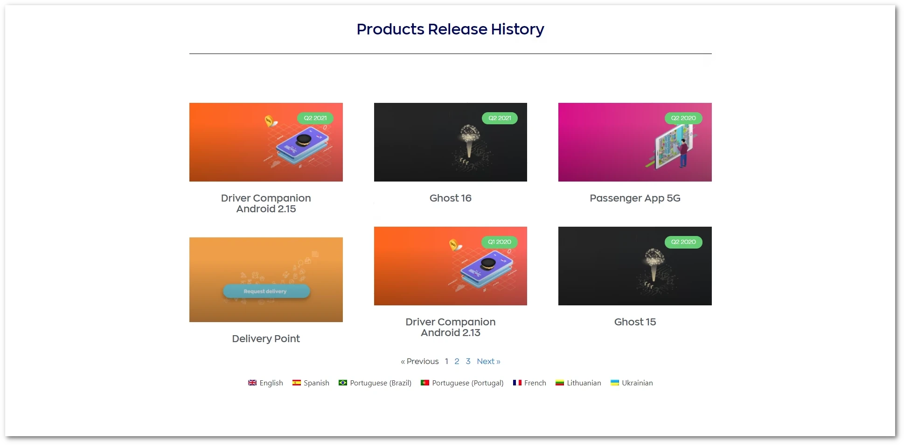
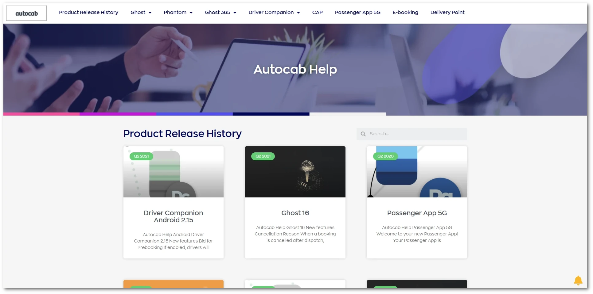

This technical writing project involved creating a new knowledge base (KB) to replace the existing static website [Autocab]() used for their release notes, and writing new documentation for each product. I did this while working as the sole technical writer within the product team. 

Initially time was spent exploring the website to understand how it works, and I found that it had the following challenges and issues:

* The documentation was hosted on WordPress with only a single static page for release notes.
* The WordPress configuration was outdated and disorganised.
* There were several plugins conflicting and causing visual issues.
* The existing documentation didn't adhere to a style guide.
* The documentation contained more marketing copy instead of helpful content.

Before starting any writing, I also reviewed all the existing documentation for Autocab's products, and began exploring their platform and using it from different user perspectives.

Once I was confident with my understanding of the products and the existing website, I started to work through the plan:

1. [Zendesk]() was chosen as the new KB host since the support team was already using it for logging their tickets, and the existing KB feature was not being used.
2. Each product was categorized into its own directory and subdirectories were created based on the product's structure.
3. A style guide was chosen to adhere to, specifically [Microsoft's Writing Style Guide](https://learn.microsoft.com/en-us/style-guide/welcome/), to maintain a consistent style, voice, and tone across the documentation.
4. User personas were defined to set the audience for each document.
5. Any existing documentation was rewritten to match the new style guide and audiences, and new documentation was created to fill in any knowledge gaps for each product.
6. A live chat service was added to the KB to aid the support team and give users an easy way to speak to support agents.
7. A chatbot was configured with automated responses to handle questions that could be answered through the KB.
8. A community forum was established to help users give their thoughts on the products, provide feedback, and suggest new features.

In the end, the project evolved into creating a complete online help centre, based on Zendesk, to centralise Autocab's support, and help users to self-serve. This then led to a reduction of support tickets thanks to the searchability of the new knowledge base and users being able to find answers to their questions easily. 